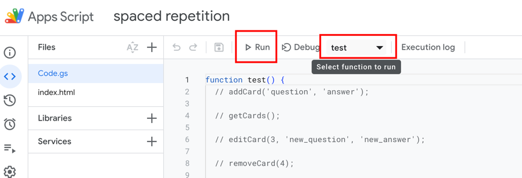
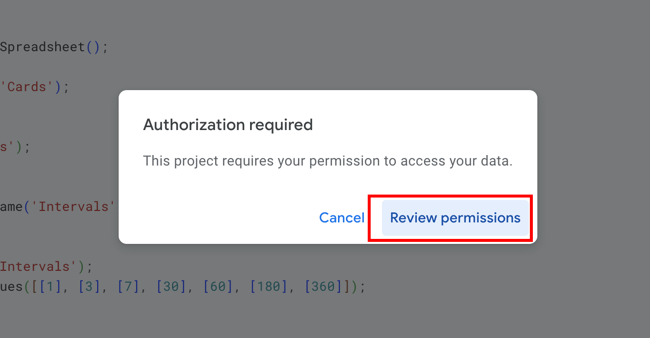
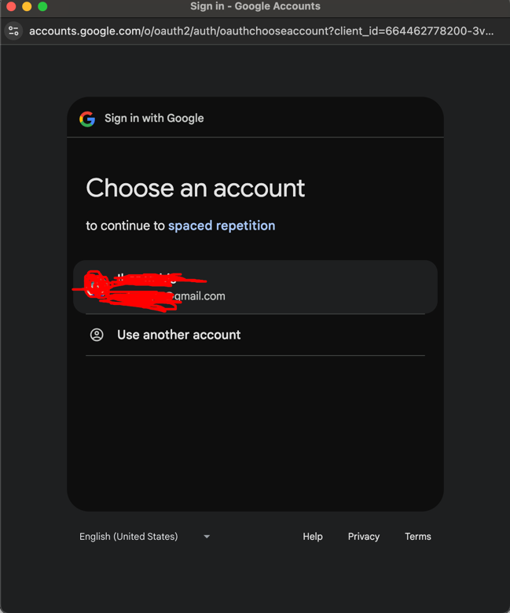
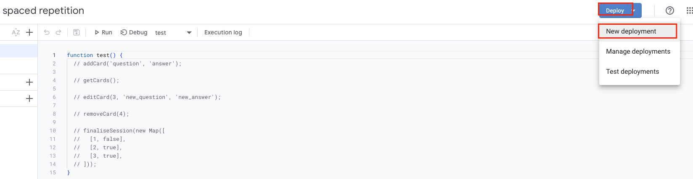
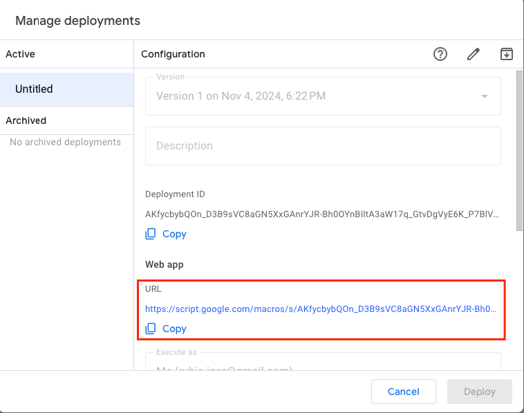

# spaced_repetition

## installation:
1. copy document from https://docs.google.com/spreadsheets/d/1uXREnVDOB9R-B1yn2z1AV284HbB9LqD5yPeMKQ1ZBYY/edit?usp=sharing (https://shorturl.at/kMpZj)
2. open document -> Extensions -> Apps Script
3. Select `test` and click `Run`
4. Click `Review permissions` 
5. Choose an account , click `Advanced` -> click `Go to spaced repetition (unsafe)` -> Allow

## verification
1. Deploy -> New deployment 
2. Click `Deploy` -> Authorize access once again
3. Use provided URL to access the UI 
Use URL: https://script.google.com/macros/s/AKfycbybQOn_D3B9sVC8aGN5XxGAnrYJR-Bh0OYnBIltA3aW17q_GtvDgVyE6K_P7BlVu4sL/exec (https://shorturl.at/cWv4M)
